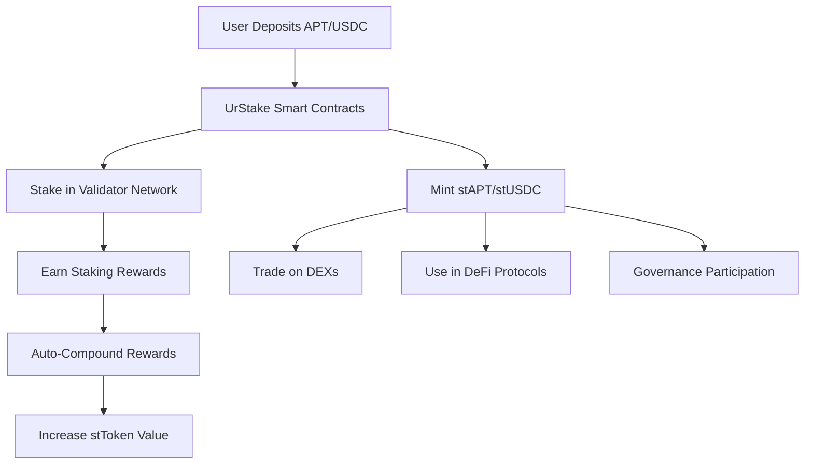

# Platform Overview

UrStake revolutionizes staking on the Aptos blockchain by providing liquid staking solutions that eliminate the traditional trade-off between earning rewards and maintaining liquidity.

## The Problem We Solve

Traditional staking presents users with a difficult choice:

- **Stake tokens** to earn rewards but lose liquidity
- **Keep tokens liquid** for trading but miss out on staking rewards

## Our Solution

UrStake provides **liquid staking tokens** that represent your staked position:

### For APT Staking

- Stake APT → Receive stAPT
- stAPT accrues staking rewards automatically
- Trade stAPT anytime without unstaking delays

### For USDC Staking

- Stake USDC → Receive stUSDC
- stUSDC earns yield through various DeFi strategies
- Instant liquidity through stUSDC trading

## Core Benefits

### 🔄 **Liquidity Preservation**

Your staked assets remain liquid through tradeable derivative tokens

### 📈 **Continuous Rewards**

Earn staking rewards 24/7 without interruption

### ⚡ **Instant Access**

No waiting periods - access your funds immediately

### 🎯 **Optimized Yields**

Smart contracts automatically compound rewards for maximum returns

### 🏛️ **Governance Rights**

Participate in protocol governance while staying liquid

## How It Works

1. **Deposit**: Send APT or USDC to UrStake smart contracts
2. **Receive**: Get stAPT or stUSDC liquid staking tokens
3. **Earn**: Automatic reward accrual and compounding
4. **Trade**: Use stTokens in DeFi or trade for instant liquidity
5. **Govern**: Vote on protocol decisions with your staked position

## Protocol Architecture

## Supported Assets

| Asset | Liquid Token | Current APY | Features                       |
| ----- | ------------ | ----------- | ------------------------------ |
| APT   | stAPT        | 8.00%+      | Auto-compounding, DEX trading  |
| USDC  | stUSDC       | 5.50%+      | Stable yield, DeFi integration |

## Next Steps

Ready to start? Choose your path:

- **New User**: [Set up your wallet](./wallet-setup)
- **APT Holder**: [Learn APT staking](../user-guide/staking-apt)
- **USDC Holder**: [Learn USDC staking](../user-guide/staking-usdc)
